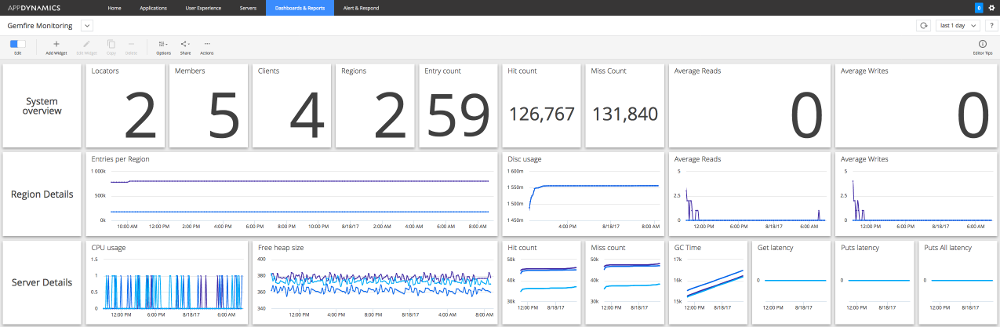

# AppDynamics Monitoring Extension for use with Pivotal GemFire/Apache Geode

## Use Case

This AppDynamics extension allows to retrieve monitoring information from Pivotal Gemfire and Apache Geode.
 
The extension connects to the JMX manager (provided by the Geode locators) and retrieve the information. The list of available metrics is 
available here:

https://geode.apache.org/docs/guide/11/managing/management/list_of_mbeans.html



## Prerequisites

None. 

## Build the extension
The project is built using Apache Maven. Run "mvn -Dmaven.test.skip=true install". You find the extension at target/GemFireMonitor-x.zip

Please note that the tests within this project programmatically create a Gemfire cluster. In order to retrieve the 
Gemfire dependencies for this test, some setup steps are necessary to authenticate against the commercial repository
of Pivotal. Please see the "Development section" if you want to run the build including the integration test.

## Install the extension
Copy and extract the GemFireMonitor-<version>.zip in the monitors folder of the machine agent. (This should create a
GemFire folder within the monitors folder).

Please ensure that you started the machine agent with high enough metric limit (https://docs.appdynamics.com/display/PRO43/Metrics+Limits)
Depending on our Gemfire/Geode cluster size and the configuration settings, this extension might create hundreds or thousand
of metrics.

Please start your machine agent accordingly:
```
nohup java -Dappdynamics.agent.maxMetrics=2000 -jar machineagent.jar &
```

## Configuration

The configuration file (monitors/Gemfire/config.yml) defines which metrics you want to capture, where your GemFire cluster are running and
what credentials you need in order to connect.

Define the server that is used to connect to the cluster. Often you point to your Apache Geode/Gemfire locator.

```
servers:
  - host: "localhost"
    port: 1099
    #serviceUrl:
    username: ""
    password: ""
    displayName: "GemFire1"
```

Configure the metric prefix setting. This allows to define where in the metric tree of AppDynamics. 

```
metricPrefix: "Server|Component:<ComponentID>|Custom Metrics|GemFire"
```

The metric section provides a pre-defined list of metrics that are gathered. The first sublevel (in this case "system")
describes the logical section the metrics should be organized. 

The mbean attribute defines the mbean query. Each entry under metrics defines an JMX attribute that should be read.
 
If you like you can define an optional AppDynamics name, that is the name that the metric should have in AppDynamics. If you do not offer this, the 
attribute name is used instead. 

The optional scale attribute allows to define a multiplication factor that is applied
to the read value. This is helpful if the read value is a percentage value.

```
metrics:
  system:
    mbean: "GemFire:service=System,type=Distributed"
    metrics:
      LocatorCount:
        appDynamicsName: "LocatorCount" # optional: Describes the name within AppDynamics
        scale: 1 # optional: Defines a value that the read value is multiplied with (interesting to stuff like hit ratios)
      MemberCount: # please note that you can configure just the value. Do not forget the colon though.
      TotalRegionCount:
      TotalRegionEntryCount:
      NumClients:
      TotalHitCount:
      TotalMissCount:
      AverageReads:
      AverageWrites:
      DiskReadsRate:
      DiskWritesRate:
      GarbageCollectionCount:
      TransactionCommitted:

```

To remove an attribute or a block, simply remove or comment it.

## Resources:

I also wrote a blog post about the extension that you can read at http://blog.novatec-gmbh.de/appdynamics-monitoring-extension-pivotal-gemfire-apache-geode/ 

## Development

To safeguard the code a local integration is setup with the project. This spawns a local Gemfire cluster and runs
the extension to retrieve data. 

Thus for the testing phase, Gemfire libraries are needed. Pivotal provides these libraries with their commercial
repository at https://commercial-repo.pivotal.io/. Pivotal created a nice documentation on how these libraries
can be retrieved (https://gemfire.docs.pivotal.io/gemfire/getting_started/installation/obtain_gemfire_maven.html).

For you to run this project you need to follow this guide: Create a Pivotal account, setup the security configuration
in maven and you are good to go.

## License

Licensed under Apache License Version 2.0.


## Optimizations / ToDos

This section lists possible improvements that could be done:

* Allow to integrate a backup server (e.g. a second locator) that takes over if the initially given server is not 
  available. 